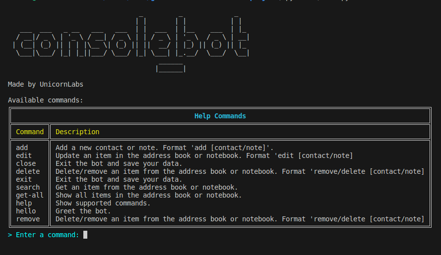

# Console Assistant Bot

Welcome to the Assistant Bot project! This bot helps users manage their contacts and notebooks. It provides a simple command-line interface for interacting with the bot.

## Features

- Add new contacts with their phone numbers, addresses, e-mails and birthdays
- Add new notebooks with their summaries, texts and tags
- Change existing contact phone numbers, addresses, e-mails and birthdays
- Change existing notebook summaries, texts and tags
- Remove existing contacts and notebooks
- View all contacts in the address book or notebooks. 
- View upcoming birthdays
- Retrieve phone numbers for specific contacts
- Greet users and provide assistance
- Search and sort contacts and notebooks.

## Getting Started

To use the Assistant Bot, follow these steps:

1. Clone this repository to your local machine.
2. Navigate to the project directory.
3. Ensure you have Python installed on your system. This project is compatible with Python 3.10
4. Install the necessary dependencies by executing the following command:
   `pip install -r requirements.txt`
5. Run the program by executing the following command (depends on you symlinks it could be **python** or **python3**):
   `python ./main.py` 
6. Follow the on-screen instructions to interact with the bot.
 
## Usage

Once the bot is running, you can enter commands to manage your contacts and notebooks. Here are the supported commands:

 - **add contact** : Add a new contact with the given name, phone number, e-mail, address and birthday
 - **add note** : Add a new notebook with the given summary, text and tag
 - **add tags** : Add tags to the existing note
 - **delete contact** or **remove contact**: Remove the specific contact from the contact book
 - **delete note** or **remove note**: Remove the specific notebook 
 - **edit contact** : Edit phone number or e-mail or address or birthday of an existing contact to a new one (*Notice, that an empty field means the data from that field will be deleted*)
 - **edit note** : Edit summary or text or tag of an existing notebook to a new one (*Notice, that an empty field means the data from that field will be deleted*)
 - **exit** or **close** : Exit the bot.
- **hello** : Greet the bot and get assistance.
- **help** :  Show supported commands.    
- **get-all contacts** : View all contacts and their phone numbers, e-mails, addresses and birthdays
- **get-all notes** : View all notebooks and their summaries, texts and tags
- **get-all birthdays** [days = 7] : View this week's upcoming birthdays.
- **search contact** : Search contact by name, phone, birthday, email or address
- **search note** : Search notebook by name, summary, text or tag

After stopping bot saves its current state to your home directory in the `.ConsoleBot` directory, `bot_data.json` file in JSON format. When the bot is started again, it will try to restore all data from this file.  

## Demo

Here is a demo of the bot in action:

 
